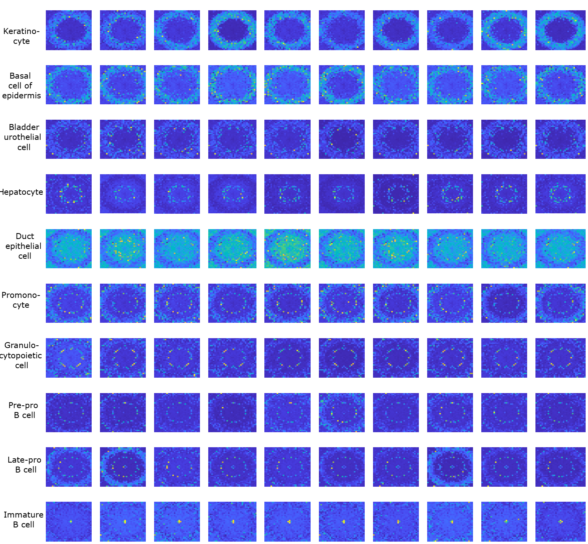

# Genomap----A New Way to analyze gene expression data

Remarkable advances in single cell genomics have presented unique challenges and opportunities for interrogating a wealth of biomedical inquiries. High dimensional genomic data are inherently complex because of intertwined relationships among the genes. Existing methods, including emerging deep learning-based approaches, do not consider the underlying biological characteristics during data processing, which greatly compromises the performance of data analysis and hinders the maximal utilization of state-of-the-art genomic techniques. In this work, we develop an entropy-based cartography strategy to contrive the high dimensional gene expression data into a configured image format, referred to as genomap, with explicit integration of the genomic interactions. This unique cartography casts the gene-gene interactions into the spatial configuration of genomaps and enables us to extract the deep genomic interaction features and discover underlying discriminative patterns of the data. We show that, for a wide variety of applications (cell clustering and recognition, gene signature extraction, single cell data integration, cellular trajectory analysis, dimensionality reduction, and visualization), the proposed approach drastically improves the accuracies of data analyses as compared to the state-of-the-art techniques.

# Required packages 

torch, torchvision, scipy, scikit-learn, pyclustering, pot, phate, pandas, opencv-python-headless, numpy, matplotlib, jupyterlab, jupyter, grad-cam

If you face any issue with packages, please check our Code-Ocean capsule, where you can check the package versions.

# Data

Please download the data from https://drive.google.com/drive/u/3/folders/1QNJdPdXf1lfq0Mu5p5JrzMDhwJJCwgO7

# Results:

Figure. Genomaps of 100 cells belonging to 10 different classes from Tabula Muris dataset. Each row in the figure corresponds to a class. For each class, the 10 cells show very similar patterns of genomap. Here, the smallest value in genomaps is denoted by blue and the largest value is denoted by yellow.

